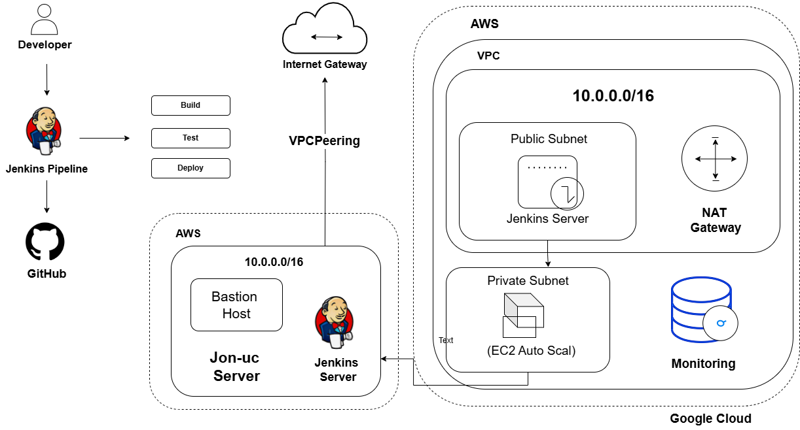

# 🛠️ Low-Level Design (LLD) – Kimai Infrastructure

This document outlines the low-level design of the Kimai time-tracking application's deployment infrastructure across AWS and GCP using Jenkins for CI/CD.

---

## 1. Network Design

### 🌐 AWS VPC
- **VPC CIDR:** `10.0.0.0/16`
- **Subnets:**
  - Public Subnet: `10.0.1.0/24` – Bastion Host, Jenkins
  - Private Subnet: `10.0.2.0/24` – Kimai App, RDS
- **Components:**
  - Internet Gateway (for public subnet)
  - NAT Gateway (for private subnet internet access)
  - Custom route tables
- **Security Groups:**
  - **Bastion Host:** Allow SSH (port 22) from specific IP
  - **Jenkins:** Allow HTTP/HTTPS (80/443)
  - **App Server:** Allow HTTP from Load Balancer only
  - **Database:** Allow PostgreSQL (5432) from app subnet only

### ☁️ GCP VPC
- **VPC CIDR:** `10.1.0.0/16`
- **Subnets:**
  - Private Subnet: `10.1.1.0/24` – Prometheus, Grafana
- **Firewall Rules:**
  - Allow metrics/logs from AWS App subnet only
  - Deny all other inbound traffic

📌 *Network diagram attached:* `Network-pipeline.drawio.png`

---

## 2. Compute Design

| Component       | Cloud | Instance Type | Purpose                                |
|----------------|-------|----------------|----------------------------------------|
| Bastion Host    | AWS   | t2.micro       | SSH access to private instances        |
| Jenkins Server  | AWS   | t2.micro       | CI/CD pipeline engine                  |
| Kimai App       | AWS   | t2.micro       | Dockerized Kimai application           |
| Monitoring Node | GCP   | e2-micro       | Prometheus and Grafana monitoring      |

### 🔁 Auto Scaling (App Server)
- **Min:** 1 instance
- **Max:** 3 instances
- **Policy:** Scale out if CPU > 70% for 5 minutes

---

## 3. Storage Design

### AWS EC2 Volumes
- Bastion, Jenkins, Kimai: **8–20 GB**, General Purpose SSD (gp2)

### AWS RDS (PostgreSQL)
- Instance: `db.t3.micro` (Free Tier)
- Storage: **20 GB** GP2
- **Backup:** Daily (7-day retention)
- **Encryption:** Enabled
- **Public Access:** Disabled

---

## 4. Security Design

### 🔐 Security Groups (AWS)
| Resource        | Ports     | Source                     |
|----------------|-----------|----------------------------|
| Bastion Host    | 22        | Your IP only               |
| Jenkins Server  | 8080      | Public subnet / Bastion    |
| App Server      | 80, 443   | Load Balancer only         |
| RDS PostgreSQL  | 5432      | App Server Security Group  |

### 🛡️ IAM Roles

#### JenkinsRole
- **Purpose:** CI/CD deployment, Docker image management
- **Permissions:**
  - `ec2:DescribeInstances`
  - `ecr:GetAuthorizationToken`
  - `ecr:BatchCheckLayerAvailability`
  - `ecr:GetDownloadUrlForLayer`
  - `ecr:PutImage`
  - `cloudwatch:PutMetricData`

#### AppServerRole
- **Purpose:** Application monitoring and log access
- **Permissions:**
  - `logs:CreateLogGroup`
  - `logs:CreateLogStream`
  - `logs:PutLogEvents`
  - `cloudwatch:PutMetricData`
  - `s3:GetObject` (for config)

---

## 5. CI/CD Design

### 🔄 Jenkins Pipeline Workflow

📌 *See attached diagram:* `jenkins-pipeline-diagram.png`

1. **Commit:** Developer pushes to GitHub
2. **Trigger:** Jenkins webhook initiates build
3. **Pipeline Stages:**

| Stage      | Description                                                     |
|------------|-----------------------------------------------------------------|
| Checkout   | Fetch code from GitHub                                          |
| Build      | Multi-stage Dockerfile builds Kimai container image            |
| Test       | Run echo/test commands (expandable)                            |
| Push Image | Tag & push to DockerHub or AWS ECR                             |
| Deploy     | Deploy to EC2 (via SSH, Ansible, or Auto Scaling Group update) |

### ✅ Docker Image Security
- Runs as **non-root**
- Includes **HEALTHCHECK**
- Uses a **minimal, secure base image**

---

## 📷 Architecture Diagram

